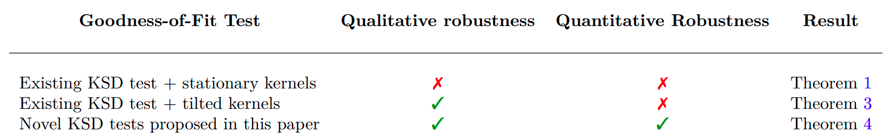

# Code for Robust-KSD Test


This repository contains the code for reproducing the experiments in the paper 
- [Liu, X. and Briol, F.X., 2024. On the Robustness of Kernel Goodness-of-Fit Tests. arXiv preprint arXiv:2408.05854.](https://arxiv.org/abs/2408.05854)

# How to install?
## Install as a package
Before running any scripts, run the following to install the current package and the dependencies. 
```bash
pip install git+https://github.com/XingLLiu/robust-kernel-test
```

## Install dependencies only
Alternatively, to install only the dependencies but not as a package, run
```bash
pip install -r requirements.txt
```

# Example
After installing as a package, it can be loaded as a Python module using
```python
import rksd
```
See `notebooks/example.ipynb` for an example of how to use this module to perform the robust-KSD test.

# Reproducibility
To reproduce all figures in the paper,
1. Run `sh sh_scripts/all.sh` to generate all results. This can take ~7 hours.
2. Run the corresponding notebooks in `notebooks/` to generate the plots.

You can also reproduce an individual experiment by running its corresponding shell script. E.g., to reproduce the Gaussian-Bernoulli Restricted Boltzmann Machine experiment, run `sh sh_scripts/rbm.sh`.

# Folder structure
```bash
.
├── rksd                          # Source files for robust-KSD test and benchmarks
├── sh_scripts                    # Shell scripts to run experiments
├── data                          # Folder to store Galaxy data and experimental results
├── figs                          # Folder to store figures
├── experiments                   # Scripts for experiments
├── notebooks                     # Jupyter notebooks for tutorial and generating plots
├── setup.py                      # Setup file for easy-install of rksd
├── requirements.txt              # Package dependencies 
└── README.md
```